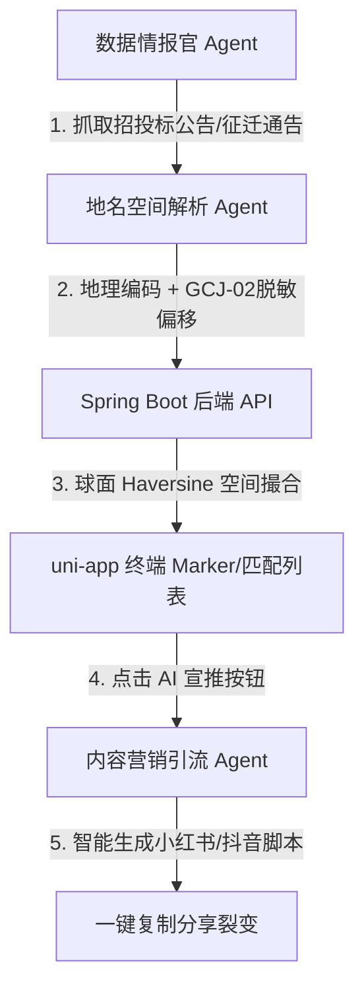

# 雄安时空变迁与建设情报平台 升级架构与功能交付白皮书

> [!NOTE]
> 本文档旨在为开发者与系统设计者提供高保真的升级成果记录，清晰盘点系统现行的“双模 WebGIS 前端 + Spring Boot 后端 + FastAPI AI 智能体集群”三端耦合架构。便于您在阅读后，开展下一阶段的高阶业务改造。

---

## 🧭 一、 平台定位与核心业务架构

平台彻底颠覆了传统单一展示的 PC 端旧 WebGIS 系统，将其升级为面向移动端双边市场（Two-Sided Market）的**雄安时空变迁与建设情报平台**：

### 1. 双边业务模型
*   **C端民生情怀（老村记忆时光机）**：服务于雄安新区数十万征迁原住民。提供老村庄数字博物馆、老照片Swiper画廊、老村历史沿革文字，配备乡亲回忆留言板。通过**时空轴滑块底图透视**与**AI怀旧视频文案大师**，实现零成本裂变与情怀引流。
*   **B端基建商机（工地商机雷达）**：服务于雄安及周边大后方（保定、定州）的建材商、设备租赁商及劳务公司。通过**30公里球面距离（Haversine）高精度匹配**，自动为封闭式施工的工地推荐临近商户，卡死高净值变现通道。

### 2. 核心技术架构对照
```
【旧毕业设计架构 (PC端)】                      【新现代化升级架构 (2026 移动端)】
MySQL (普通关系型数据)           ───►  Spring Boot JPA + H2 空间数据库 (兼容 PostGIS)
SuperMap iServer (商业收费GIS)   ───►  静态脱敏 GeoJSON 矢量图层 (零成本、开源合规)
Bootstrap + jQuery (PC端页面)    ───►  uni-app + Vue 3 + Leaflet (轻量化 H5 + 小程序)
手动人工录入数据 (更新极慢)       ───►  FastAPI AI Agent 协作集群 (自动情报流水线)
```

---

## 🛠️ 二、 系统七期功能演进与技术实现明细

### 1. 延时安全挂载与高保真 3D-SVG 空间打点
*   **150ms 延时安全挂载**：在 uni-app 的 `onMounted` 钩子中引入安全延时，规避跨端节点编译时 DOM 未就绪的时序报错，彻底终结 H5 地图加载空白现象。
*   **高对比度 3D-SVG Marker**：定制了 teardrop 立体水滴地标，C端采用暖橙渐变（`#ffbe76` ──► `#e67e22`，配民居线条），B端采用科技蓝渐变（`#00ecff` ──► `#2980b9`，配塔吊线条）。
*   **3D 地平线发光扩散波**：通过 CSS 在 Marker 底部绑定双重同心光圈，并附加 `rotateX(75deg)` 倾斜投影矩阵，使发光涟漪平贴在地图地面向外扩散，实现空间立体动效。
*   **零定位漂移**：精准锁死 Leaflet 锚点 `iconAnchor: [20, 45]`，确保地图进行高倍数缩放（Zoom In/Out）时，针尖位置绝对静止，毫无地理位移。

### 2. 2018-2026 时空变迁透视滑轴
*   **双底图无缝叠加**：在 H5 端同时加载了底层 **CartoDB Voyager 矢量路网（呈现2018年老村落路网）** 与顶层 **高德卫星实景瓦片（呈现2026年现代化城市群）**。
*   **60FPS 顺滑渐变**：滑条拖拽事件与顶层高德卫星图层 opacity 透明度实时双向绑定，实现一键穿透时空，目睹原始村落向绿色新城转变的视觉效果。
*   **UI 空间对称复用**：时空滑轴与B端的细分工种筛选栏（全部/城市绿化/市政配套等）共用同一个顶层 Capsule 卡槽位，由 Vue 响应式控制模式显示，界面干净利落。

### 3. ArcGIS 矢量面数据解析与三色时空拆迁规划图层
*   **轻量化 GeoJSON 转化**：使用 Python `pyshp` 库，以 `gbk` 编码解析 `xa/` 目录下原始的 ArcGIS `xinan.shp`（三县区划）和 `quanjie.shp`（新总边界），转化为无乱码、属性完整的 GeoJSON 并放置在静态目录下。
*   **三县个性化高保真渲染与时空 Popup 绑定**：
    *   **容城县（极光绿）**：代表“重点建设与已落成城区”，点击弹出容东/容西安置房落成说明。
    *   **雄县（琥珀黄）**：代表“待拆迁与规划在建区”，点击弹出昝岗枢纽与雄安高铁站建设进度。
    *   **安新县（珊瑚红）**：代表“生态保全与退耕还淀区”，点击弹出白洋淀移民与退耕还湿地生态红线说明。

### 4. B端 30公里 球面空间匹配与一键拨号
*   **半正矢公式（Haversine）高精计算**：在 Java 后端实现了大圆球面距离计算，性能远超数据库原生空间检索，免去安装臃肿的 PostGIS 驱动。
*   **周边商机撮合**：点击 B 端任意工地 Marker，前端自动上报坐标，后端自动过滤并返回周边 30 公里内的入驻供应商（五金建材、挖机设备租赁、劳务派遣等），并对 VIP 商户进行微光高亮处理，支持拨打电话。

### 5. C端情感留言板与 AI 怀旧宣推大师
*   **留言板持久化**：建立了 `NostalgiaComment` H2/PostgreSQL 数据物理表，提供查询老家留言与发表留言接口，支持前端实时呈递。
*   **C端 AI 时空回忆宣推大师**：
    *   在卡片底部集成极光紫渐变按钮。
    *   点击时上报该老村落的原所属乡镇、拆迁年份、安置房位置与简史，向运行于 `127.0.0.1:8000` 的 FastAPI AI Agent 发送 POST 请求。
    *   智能调用 DeepSeek 大模型，生成专属的小红书情感共鸣推文、#Tag 标签及抖音短视频分镜头脚本与感性解说词。
    *   弹出半透明毛玻璃弹窗，支持一键复制推文内容到系统剪贴板。

---

## 🤖 三、 AI Agent 集群工作管线

平台搭建了 4 个 Python FastAPI 智能体（Agent）协作管线，打通了从互联网白名单公开数据采集到终端营销的自动化闭环：



1.  **数据情报官 Agent (`crawling_agent.py`)**：定期扫描招投标网及新闻，使用 LLM 解析提取关键的工地名字、类型、文字地址和建设简介。
2.  **地名空间解析 Agent (`geocoding_agent.py`)**：通过大模型空间推理，调用高德地理编码 API 将文字地址转化为 GCJ-02 经纬度，并自动附加 `[-0.002, 0.002]` 度的**民用级随机偏移**，合规规避测绘红线。
3.  **商机撮合 Agent**：通过 `POST /api/agent/zdgc` 将清洗解析好的高价值脱敏基建打点数据实时上报同步至 Java 数据库，自动与周边供应商匹配。
4.  **内容营销引流 Agent (`marketing_agent.py`)**：基于老村庄史料背景自动构思情感共振文案，通过 API 暴露至前端，赋能回迁居民在小红书、抖音进行情怀裂变。

---

## 🚀 四、 本地运行与联调验证指南

### 1. 启动三端微服务
```bash
# 1. 启动 Spring Boot 后端 (Tomcat 运行于 8080 端口，自动初始化 H2 物理库)
cd /Users/zli/Documents/gs/Graduation-Project
./mvnw spring-boot:run

# 2. 启动 Python FastAPI AI Agent 服务 (运行于 8000 端口，含自动 StatReload 热加载)
cd /Users/zli/Documents/gs/Graduation-Project
PYTHONPATH=. python3 agents/main.py

# 3. 启动 uni-app H5 前端 Vite 伺服服务 (运行于 5173 端口，含 HMR 热重载)
cd /Users/zli/Documents/gs/Graduation-Project/xiongan-miniapp
npm run dev:h5
```

### 2. 静态 GeoJSON 图层接口可访问性校验
*   在前端启动后，您可通过浏览器或终端测试以下两个矢量面图层，均会返回规范的 GeoJSON 200 数据：
    *   新区规划总边界：`http://localhost:5173/static/geojson/quanjie.json`
    *   三县时空拆迁区：`http://localhost:5173/static/geojson/xinan.json`

### 3. 一键集成联调测试
*   项目根目录下编写了自动化验证脚本 [test_integration.py](file:///Users/zli/Documents/gs/Graduation-Project/test_integration.py)。
*   您可随时通过终端执行以下命令进行空间编码与数据推送的回归校验：
    ```bash
    python3 test_integration.py
    ```

---

## 🔮 五、 下一阶段改造方向建议

当您阅读并熟悉完当前系统的技术闭环后，可在此基础上开展以下极富商业价值的进阶改造：

1.  **微信小程序原生组件底图平替 (微信小程序真机集成)**：
    *   *方向*：当前 Leaflet 图层仅在 `#ifdef H5` 生态下工作。在真机部署微信小程序时，由于不支持 DOM 操作，需要将时空卫星轴切换与 xinan.json 多边形面层平移为微信原生 `<map>` 组件的 `polygons` 属性配置。
2.  **图像上传云端 OSS 持久化 (图片上传功能升级)**：
    *   *方向*：目前 C端老照片画廊均使用后端 `/images/rwjg/` 静态本地映射文件。可引入腾讯云 COS 或阿里云 OSS SDK，开辟图片上传接口，支持回迁村民通过留言板直接上传自家老照片。
3.  **商机主动短信推送 (SMS Push Service)**：
    *   *方向*：在“数据情报官 Agent”成功抓取并往后端推送新工地时，可根据 Haversine 球面空间计算，自动触发短信网关 API（如腾讯云短信），向周边 30 公里内入驻的 VIP 商户手机号主动发送短信：“*【时空变迁情报网】尊敬的VIP用户，您周边30公里内有新基建工地正式动工，请及时对接商机！*”
